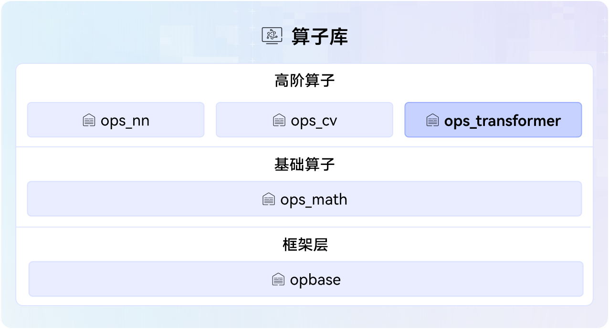

# ops-transformer

## 🔥Latest News

- [2025/09] ops-transformer项目首次上线。

## 🚀Overview

ops-transformer is an advanced operator library that provides transformer-class large model computing in the [CANN](https://hiascend.com/software/cann) (Compute Architecture for Neural Networks) operator library, including attention and moe operators. The following figure shows the operator library architecture.



## 🔍Directory Structure
Key directories are as follows. For detailed directory descriptions, please refer to [Project Directory](./docs/context/dir_structure_en.md)。
```
├── cmake                   # Project build directory
├── common                  # Common header files and source code of the project
├── attention               # Attention class operators
│ ├── flash_attention_score # All deliverables of the flash_attention_score operator, such as Tiling and Kernel
│ │ ├── CMakeLists.txt      # Operator build configuration file
│ │ ├── docs                # Operator documentation
│ │ ├── examples            # Examples of using the operator
│ │ ├── op_host             # Directory for operator information library, Tiling, and InferShape related implementations
│ │ │ └── op_api            # Directory for ACLNN operator API implementation
│ │ ├── op_kernel           # Operator Kernel directory
│ │ └── README.md           # Operator documentation
│ ├──...
│ └── CMakeLists.txt        # Operator build configuration file
├── docs                    # Project documentation
├── examples                # End-to-end operator development and invocation examples
├── experimental            # Directory for storing user-defined operators
├──...
├── moe                     # MOE class operators
├── posembedding            # POSEmbedding class operators
├── scripts                 # Script directory, containing configuration files related to custom operator and Kernel building
├── tests                   # Test project directory
├── CMakeLists.txt          # CMakeLists.txt file for the test project.
```

## ⚡️Getting Started

If you want to quickly experience the process of calling and developing operators, please refer to the following documents for a quick start guide.
- [Operator List](docs/op_list.md): Provides comprehensive information about all operators provided by the project for quick reference.
- [Operator Invocation](docs/invocation/quick_op_invocation.md): Introduces the basic steps for calling operators, setting up the environment quickly, and implementing operator compilation and execution.
- [Operator Development](docs/develop/quick_op_develop.md): Describes the basic workflow for developing operators, including creating operator project directories with one click and delivering core components such as Tiling and Kernel.

## 📖Learning Tutorial

If you wish to deeply experience the project features and modify the operator source code, please refer to the following documents for detailed tutorials:
- [Operator Invocation Methods](docs/invocation/op_invocation.md): Introduces different ways to invoke operators, making it easy to quickly apply them to various AI business scenarios.
- [Operator Debugging and Optimization](docs/debug/op_debug_prof.md): Describes common methods for debugging and optimizing operators, such as DumpTensor and msProf.
- [Basic Concepts of Operators](docs/context/basic_concepts.md): Explains terminology and concepts related to the operator domain, such as non-contiguous tensors and quantization modes.

## 📝Related Information
- [Contribution Guide] (CONTRIBUTING.md)
- [Security Statement] (SECURITY.md)
- [License] (LICENSE)
