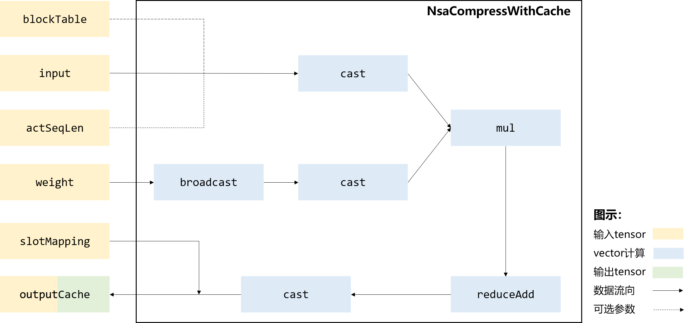

声明：本文使用[Creative Commons License version 4.0](https://creativecommons.org/licenses/by/4.0/legalcode)许可协议，转载、引用或修改等操作请遵循此许可协议。

# NsaCompressWithCache算子设计介绍

- 算子功能：用于Native-Sparse-Attention推理阶段的KV压缩，每次推理每个batch会产生一个新的token，每当某个batch的token数量凑满一个compress\_block时，该算子会将该batch的后compress\_block个token压缩成一个compress\_token，算法流程如下：

1. 检查act\_seq\_lens是否有满足满足$s \ge compressBlockSize$ 且 $(s - compressBlockSize) \% stride ==0$的序列长度；
2. 找到满足序列长度的batchIdx，根据block\_table找到该batch的后compress\_block\_size个token压缩；
3. 执行压缩算法；
4. 根据slot\_mapping写回到output\_cache中。

- 计算公式

$$
compressIdx=(s-compressBlockSize)/stride\\ 
ouputCacheRef[slotMapping[i]] = input[compressIdx*stride : compressIdx*stride+compressBlockSize]*weight[:]
$$

## 实现原理

图1 计算流程图：




整体计算流程如下：

1. 将全量weight从GM取到UB上，并将其广播到和kv一样的大小，根据每个核心处理headNum的大小，可能需要通过二次广播才能得到和kv大小相同的weight；

2. 将kv从GM上搬运到UB上，根据actSeqLen和blockTable获取当前需要从哪几个page搬运数据，然后分page将数据跳读搬运到UV；

3. 将kv和广播后的weight计算逐元素乘，并在第一维上执行reduceAdd，计算结束后将结果搬出。

## 模板设计

为了使不同的输入可以复用相同的tiling和流水，采用了模板的方式来实现融合算子，但是不同的输入全部使用同一套模板时又无法达到性能最优和功能泛化，因此需要根据输入shape的特征区分不同的模板来实现。

### 模板类型

1. All-Vector模板：目前仅实现了全vector的模板

### 计算过程

#### 数据切分

由于硬件buffer大小是有限的，而计算的数据量又是巨大的，无法一次计算完，那么就需要进行tiling切分，shape不同会导致算子的切分轴不同，而算子的切分轴，会影响模板的功能及性能。简单的elewise类算子，往往会将所有的轴fuse成一根轴进行切分，逻辑简单，因此模板也比较单一。而融合算子融合了elewise、broadcast、reduce及matmul等多类场景，功能复杂，为达到较高的性能要求，往往需要根据切分轴进行模板拆分，模板拆分时为了达到性能最优，需要考虑如下几个点：

a. 将核心的数量用满，防止部分核闲置 ；

b. 每一个核心被分配的计算量相对均匀，避免出现某些核计算的数据量过大，其余核在围观的情况；

c. AIC和AIV之间处理的数据量要符合其对应的算力，避免AIC或AIV出现长时间的空闲。 

NsaCompressWithCache算子包含B(batch)、C(compressWithCache)、N(headNum)、D(headDim)共4个轴， 当前核间仅在B和N上进行切分，核内仅在C上进行切分，逻辑如下：

- 核间：数据外切是为了最大限度的利用多个Core并行工作，通常先按照B分核，如果切分B切分后，CND块放不下则需要进一步切分N，并限制每个core分到的n（切分后的N）为2的幂次，单个core不会同时处理两个batch的数据，尽量满足读取数据时，一次读取的连续数据对齐512B。

- 核内：由于单core缓存有限，需根据设定的缓存大小，对B，C进行切分，外循环处理B的数据，内循环分多次处理c（切分后的C）nD数据，最后再将这些数据reduce得到最终结果。

#### 主流程

```c
// 单核计算伪码
void compute() {
    AscendC::LocalTensor<T> kvCacheLocal = inQueue.DeQue<T>();
    // cast fp16 to fp32
    AscendC::LocalTensor<float> castKvCacheLocal = kvCalcBuf.template Get<float>();
    AscendC::Cast(castKvCacheLocal, kvCacheLocal, AscendC::RoundMode::CAST_NONE, tilingData->kvCacheSizePerCore);
    pipe_barrier(PIPE_V);
    inQueue.FreeTensor(kvCacheLocal);

    AscendC::LocalTensor<float> broadcastWeightLocal = broadcastWeightBuf.template Get<float>();

    // elem-wise mul & reduce
    AscendC::Mul(castKvCacheLocal, castKvCacheLocal, broadcastWeightLocal, tilingData->kvCacheSizePerCore);
    pipe_barrier(PIPE_V);
    ReduceBlock(castKvCacheLocal, tilingData->compressBlockSize, tilingData->alignReduceSize);

    // cast fp32 to fp16
    AscendC::LocalTensor<T> compressKvCacheLocal = outQueue.AllocTensor<T>();
    AscendC::Cast(compressKvCacheLocal, castKvCacheLocal, AscendC::RoundMode::CAST_RINT,
                  tilingData->compressKvCacheSizePerCore);
    pipe_barrier(PIPE_V);
    outQueue.EnQue<T>(compressKvCacheLocal);
}
```

#### UB分配

NsaCompressWithCache算子对UB分配进行了简化， 初始化时，将UB按照固定大小进行划分（实际大小参见最新代码）：

| UB块                      | Size      | 使用场景                                                 |
| ------------------------- | --------- | ------------------------------------------------------- |
| inputQue                  | 24K       | 从GM加载input与weight                                    |
| outQueue                  | 3K        | 将结果写回output                                         |
| kvCalcBuf                 | 96k       | cast后的kv+暂存reduce结果                                 |
| broadcastWeightBuf        | 24k       | 广播后的weight                                           |
| weightCalcBuf             | 45k       | 用于跳读weight、广播weight的中间计算结果暂存               |

#### WorkSpace分配

workspace用于保存算子计算过程中不适合常驻UB的中间数据，本算子不使用WorkSapce

## Tiling设计

### 分核设计

​        Tiling操作的目的是为了找到一种更高效的NPU执行方式，原始的数据量一般是非常大的，没有办法通过一次指令调用就完成所有计算，因此需要将数据量分到多个核上并行计算，且每个核上也需要考虑如何循环计算性能最优，不同的输入可能有不同的最优执行方式，所以需要通过tiling策略决定怎么将数据分配到各个核上进行计算。

如前所述，总块数为B*(C/c)*(N/n)，主要需要确定n的大小，计算逻辑如下：

### TilingKey 规划

TilingKey为uint64 类型，通常每个模板参数对应TilingKey中的一个十进制位，部分BOOL类型的模板参数采用组合方式在一个十进制位中表示。

```c++
    uint64_t GetTilingKey() const override
    {
        uint32_t is_fp16 = 0;
        const auto *kvDesc = context_->GetRequiredInputDesc(INPUT_INDEX_INPUT);
        OPS_LOG_E_IF_NULL(context_, kvDesc, return ge::GRAPH_FAILED);
        auto kvDtype = kvDesc->GetDataType();
        if (kvDtype == ge::DT_FLOAT16) {
            is_fp16 = 1;
        }
        return weightInitFlag * NUM_2 + is_fp16;
    };
```

字段说明：

| 十进制位  | 变量             | 说明                                                         |
| -------- | ---------------- | ------------------------------------------------------------ |
| 0        | dtype            | 输入dtype，0: fp16；1:bf16                                    |
| 1-2      | weightInitFlag   | weight广播方法， 0:二次广播;  1: 一次广播+ub跳读；  2：一次广播  |


