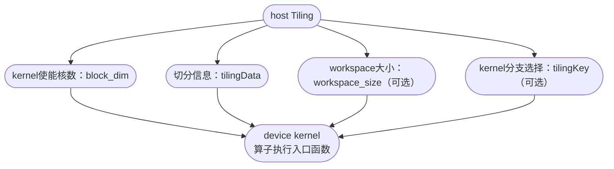

# 算子开发指南

## 概述

本章以`AddExample`算子为例，介绍算子开发过程以及涉及的交付件。端到端流程如图所示：


1. [环境准备](#环境准备)：开发算子前，请确保依赖的驱动、固件、CANN软件包等已安装。
2. [算子设计](#算子设计)：根据实际业务场景和硬件本身要求，设计合适的算子输入、输出、属性等信息，包括shape、数据类型、数据格式等。
3. [工程创建](#工程创建)：一键创建工程目录。
4. [算子Tiling实现](#算子Tiling实现)：实现Host侧Tiling函数。
5. [算子Kernel实现](#算子Kernel实现)：实现Device侧算子的核函数。
6. [InferShape与InferDataType实现](#InferShape与InferDataType实现)（可选）：仅当需要算子入图时，才需要完成dataType推导与shape推导。
7. [框架适配](#框架适配)：aclnn接口适配及图模式适配。
8. [算子包编译部署](#算子包编译部署)：通过工程编译脚本完成算子的编译和安装。

对于上述流程，在不同场景下，算子开发实现的步骤不同，请根据实际情况按需选择。
- KernelLaunch调用：实现步骤1~5、步骤8
- aclnn调用：实现步骤1~5、步骤7、步骤8
- 图模式调用：实现步骤1~8

## 环境准备

环境准备参考项目首页[环境准备](../README.md#环境准备)。

## 算子设计

算子设计是整个算子开发流程中的核心环节，其目标是将模型中的数学计算逻辑转化为可执行的代码逻辑，并未后续的工程实现、编译部署和调用提供清晰的接口和规范。

以下以`AddExample`样例算子为例，介绍算子设计的完整流程，并结合流程图进行说明。


### 1、设计数学表达式

算子设计的第一步是明确其数学表达式。`AddExample`算子的功能是对两个四维张量进行逐元素相加操作，其数学表达式为
```
y[i] = x1[i] + x2[i]
```
其中`i`表示张量中每个元素的索引，`x1`和`x2`是两个输入张量，`y`是输出张量。

### 2、明确输入和输出

在明确了算子的数学表达式之后，需要进一步明确其输入输出的格式、数据类型和形状。
- 输入：
        
        - x1: 四维张量，shape为(32,4,4,4)
        - x2: 四维张量，shape为(32,4,4,4)
        - 数据类型支持：float32或int32
        - 数据格式: ND
- 输出：
        
        - y: 四维张量，shape为(32,4,4,4)
        - 数据类型与输入一致
        - 数据格式: ND

### 3、确定核函数名称和参数

核函数是算子的核心实现部分，负责完成具体的计算逻辑。
- 核函数名称：add_example

- 参数说明：

        - x1: 第一个输入张量
        - x2: 第一个输入张量
        - y: 输出张量
核函数的参数顺序为：输入1，输入2，输出。

核函数名称以**算子名小写下划线**命名。

### 4、确定算子实现所需接口

在实现算子时，需要调用Ascend C提供的相关接口，完成数据搬运、内存管理、计算操作核任务调度等功能。

1、数据搬运：

- 使用`DataCopy`接口实现从外部存储搬运到内部存储的数据搬运。

2、相加计算：

- 使用双目运算接口`Add`实现两个张量逐元素相加操作。

3、内存管理：

- 使用`AllocTensor`申请张量内存空间。
- 使用`FreeTensor`释放张量内存空间。

4、任务调度与同步：
- 使用`EnQue`和`DeQue`接口实现并行任务之间的同步与调度。

### 5、算子设计规格总结

通过以上分析，`AddExample`算子的设计规格如下：

<table>
<tr>
<th>算子类型</th>
<td colspan="4" align="center">AddExample</td>
</tr>
<tr>
<th>算子表达式</th>
<td colspan="4" align="center">y[i] = x1[i] + x2[i] </td>
</tr>
<tr>
<th rowspan="3" >算子输入</th>
<th>name</th>
<th>shape</th>
<th>dataType</th>
<th>format</th>
</tr>
<tr>
<td>x1</td>
<td>(32,4,4,4)</td>
<td>float/int32</td>
<td>ND</td>
</tr>
<tr>
<td>x2</td>
<td>(32,4,4,4)</td>
<td>float/int32</td>
<td>ND</td>
</tr>
<tr>
<th>算子输出</th>
<td>y</td>
<td>(32,4,4,4)</td>
<td>float/int32</td>
<td>ND</td>

</tr>
<tr>
<th rowspan="5" align="top">使用的主要接口</th>
</tr>
<tr>
<td colspan="4" >DataCopy：数据搬移接口</td>
</tr>
<tr>
<td colspan="4" >Add：矢量双目指令接口</td>
</tr>
<tr>
<td colspan="4" >AllocTensor、FreeTensor：内存管理接口</td>
</tr>
<tr>
<td colspan="4" >EnQue、DeQue接口：Queue队列管理接口</td>
</tr>
<tr>
<th rowspan="5" >算子实现文件</th>
<td colspan="4" >[add_example.h]</td>
</tr>
</table>

## 工程创建

工程创建时算子开发中的重要步骤，它为后续的代码编写、编译构建和调试提供统一的目录结构和文件组织方式。后续支持使用工具一键生成项目目录结构。当前手动创建。

以下是`AddExample`样例算子的工程目录结构说明：

```
├── op_graph                                        // 图融合相关
│   ├── CMakeLists.txt                              // op_graph侧cmakelist文件
│   ├── add_example_graph_plugin.cpp                // 算子inferDataType文件
│   └── add_example_proto.h                         // 算子原型
├── op_host                                         // 算子Host侧实现目录
│   ├── add_example_def.cpp                         // 算子信息库
│   ├── add_example_infershape.cpp                  // 算子InferShape实现
│   ├── add_example_tiling.cpp                      // 算子tiling实现
│   └── CMakeLists.txt                              // host侧cmakelist文件
└── op_kernel                                       // 算子Device侧Kernel实现目录
│   ├── add_example_tiling_key.h                    // 算子tilingkey文件
│   ├── add_example_tiling_data.h                   // 算子tilingdata文件
│   ├── add_example.cpp                             // 算子kernel入口文件
│   └── add_example.h                               // 算子kernel实现文件
└── CMakeLists.txt                                  // 算子cmakelist入口
```

### 目录与文件说明：

1、`op_graph`目录

该目录用于图融合阶段的相关文件，主要包含算子原型定义文件。
- `add_example_proto.h`: 定义算子的原型信息，用于图优化和融合阶段识别算子。
- `add_example_graph_plugin.cpp`: 实现算子的类型推导逻辑，用于在运行时推导输出张量的dataType。
- `CMakeLists.txt`: 用于配置`op_graph`模块的构建规则。

2、`op_host`目录

该目录存放算子在Host侧的实现文件，主要包括算子的元信息，形状推导，任务划分等逻辑。
- `add_example_def.cpp`: 定义算子的基本信息，如名称、输入输出数量、数据类型等。
- `add_example_infershape.cpp`: 实现算子的形状推导逻辑，用于在运行时推导输出张量的shape。
- `add_example_tiling.cpp`: 实现算子的Tiling策略，用于将张量划分为多个小块，并区分数据类型进行并行计算。
- `CMakeLists.txt`: 用于配置`op_host`模块的构建规则。

3、`op_kernel`目录
- `add_example_tiling_key.h`: 定义Tiling策略的Key，用于标识不同的划分方式。
- `add_example_tiling_data.h`: 存储Tiling策略相关的配置数据，如块大小，并行度等。
- `add_example.cpp`: 算子kernel的入口文件，包含主函数和调度逻辑。
- `add_example.h`: 定义kernel的头文件，包含函数声明，结构定义及逻辑实现。

## 算子Tiling实现

### Tiling简介

在NPU（神经网络处理单元）中，由于AI Core内部存储空间有限，无法一次性将整个张量数据加载到计算单元中进行处理。因此，需要将输入张量切分为多个小块（tile），逐块进行计算，这一过程称为`Tiling`。用于指导数据切分的算法称为`Tiling策略`或者`Tiling算法`。

Tiling策略决定了如何将输入数据切分为多个计算快，并指导Kernel(内核)如何分配内存、调度计算任务。Tiling与Kernel之间通过`TilingData`结构体进行信息传递。

Tiling的实现流程如下图所示：


#### 1、通过Tiling入参获取算子规格、环境信息

在Tiling实现的第一步，需要从输入参数中获取算子的规格信息核运行环境信息，包括可用核数、UB(Unified Buffer)大小、输入张量的shape和数据类型等。

**获取可用核数`coreNum`**

```CPP
// 获取平台信息指针
fe::PlatFormInfos* platformInfoPtr = context->GetPlatformInfo();
OP_CHECK_NULL_WITH_CONTEXT(context, platformInfoPtr);

// 创建 Ascend C 平台对象
auto ascendcPlatform = platform_ascendc::PlatformAscendC(platformInfoPtr);

// 获取可用的AI Core 数量
coreNum = ascendcPlatform.GetCoreNumAiv();
```

**获取UB缓冲区大小`ubSize`**
```CPP
// 获取 UB 缓冲区大小
ascendcPlatform.GetCoreMemSize(platform_ascendc::CoreMemType::UB, ubSize);
```

**获取输入张量的shape信息`inputShapeX`**
```CPP
// 获取输入张量 shape 信息
auto inputX = context->GetInputShape(0);
OP_CHECK_NULL_WITH_CONTEXT(context, inputX);

// 如果输入shape 是标量 转换为{1}，否则保持原 shape 不变
auto inputShapeX = EnsureNotScalar(inputX->GetStorageShape());
```
**获取输入张量的数据类型`dataType`**
```CPP
// 获取输入张量的描述信息
auto inputDesc = context->GetInputDesc(0);
OP_CHECK_NULL_WITH_CONTEXT(context, inputDesc);

// 获取数据类型
dataType = inputDesc->GetDataType();
```


#### 2、合法性校验
在获取到算子的规格和环境信息后，需要对这些信息进行合法性校验，确保后续Tiling算法和Kernel实现可以正常运行。

**指针非空校验**
```CPP
OP_CHECK_NULL_WITH_CONTEXT(context, inputDesc);
```

**shape校验**
```CPP
OP_CHECK_IF(
    inputShapeX.GetDimNum() != DIMS_LIMIT || inputShapeY.GetDimNum() != DIMS_LIMIT ||
        outShapeZ.GetDimNum() != DIMS_LIMIT,
    OP_LOGE(
        context, "AddExample: inputx,inputy,outputz shape dim = %zu, %zu, %zu, should be equal 4",
        inputShapeX.GetDimNum(), inputShapeY.GetDimNum(), outShapeZ.GetDimNum()),
    return ge::GRAPH_FAILED);
```

**数据类型校验**
```CPP
// 支持的数据类型集合
const std::set<ge::DataType> supportedDtype = {ge::DT_FLOAT, ge::DT_INT32};

// 获取输入数据类型
auto inputDesc = context->GetInputDesc(0);
OP_CHECK_NULL_WITH_CONTEXT(context, inputDesc);

// 校验数据类型是否在支持范围内
dataType = inputDesc->GetDataType();
if (supportedDtype.count(dataType) == 0) {
    OP_LOGE(context, "invalid dtype");
    return ge::GRAPH_FAILED;
}
```

#### 3、Tiling策略设计

Tiling 算法的目标是：

- 充分利用硬件资源：通过多核并行核块级并行，提高计算效率。
- 合理分配内存：根据每个tile的大小，合理分配UB内存。
- 保证计算正确性；确保每个tile的计算逻辑核整体逻辑一致，结果正确。

以`AddExample`样例算子为例，其输入张量的shape大小为 `(32, 4, 4, 4)` 总元素个数为`2048`。为了充分利用硬件资源，我们设计如下Tiling策略：

- 启用8个核（coreNum = 8）进行计算
- 每个核内部再将数据分为8块（tileNum=8），实现更细粒度的并行。
- 总数据量2048个元素，每个核处理2048/8=256个元素。
- 每个核内部再将256个元素划分为8块，每块处理32个元素。
- 对支持的数据类型，通过tilingkey指定不同的kernel分支（可选）。

#### 4、Tiling算法实现

Tiling的策略需要与Kernel实现紧密配合，Tiling负责指导Kernel的内存分配和张量切分，Kernel则根据Tiling提供的信息进行计算调度。Tiling与Kernel之间的信息传递通过`TilingData`结构体完成。

在Tiling实现中，需要完成以下关键项的处理：



**设置kernel使能核数**

在Host侧的Tiling实现中，需要设置Kernel执行时所使用的核数（即并行度），通过`SetBlockDim`接口设置。
```CPP
context->SetBlockDim(BLOCK_DIM); // BLOCK_DIM 表示启用的核数量
```
**设置tilingData信息**
根据tiling策略设计，我们需要将以下信息传递给kernel：
 - 总数据量大小： totalLength
 - 每个核中数据切块数量：tileNum

1、定义TilingData结构体
```CPP
struct AddExampleTilingData {
     int64_t  totalLength;  // 输入张量总元素个数
     int64_t  tileNum;  // 每个核内部数据切块数量
};
```

- 命名规范：
    - 结构体名称：`算子名大驼峰+TilingData`，如`AddExampleTilingData`
    - 文件名：`算子名小写下划线+tiling_data.h`如[add_example_tiling_data.h](../../example/add_example/op_kernel/add_example_tiling_data.h)

2、设置TilingData信息
```CPP
// 4、设置tiling信息
AddExampleTilingData* tiling = context->GetTilingData<AddExampleTilingData>();
OP_CHECK_NULL_WITH_CONTEXT(context, tiling);
OP_CHECK_IF(
    memset_s(tiling, sizeof(AddExampleTilingData), 0, sizeof(AddExampleTilingData)) != EOK,
    OP_LOGE(context, "set tiling data error"), return ge::GRAPH_FAILED);
tiling->totalLength = totalIdx;
tiling->tileNum = TILE_NUM;
```

**设置Workspace大小（可选）**

如果算子在执行过程中需要额外的临时内存（workspace），可以在Tiling中设置其大小。该设置为可选项，根据算子需求决定是否使用。
```CPP
size_t* currentWorkspace = context->GetWorkspaceSizes(1);
OP_CHECK_NULL_WITH_CONTEXT(context, currentWorkspace);
currentWorkspace[0] = WS_SYS_SIZE;
```

**设置TilingKey（可选）**

在某些复杂算子中，Kernel可能根据不同的Tiling策略选择不同的执行路径。可以通过tilingKey来标识不同的分支策略。该设置为可选项。


`AddExample`样例算子中，我们根据不同的数据类型，选择不同的kernel分支。

TilingKey通过模板化编程实现。

```C++
#define ELEMENTWISE_TPL_SCH_MODE_0 0
#define ELEMENTWISE_TPL_SCH_MODE_1 1

// 1、定义模板参数
ASCENDC_TPL_ARGS_DECL(AddExample,               // 算子OpType
    ASCENDC_TPL_UINT_DECL(schMode, 1, ASCENDC_TPL_UI_LIST, ELEMENTWISE_TPL_SCH_MODE_0, ELEMENTWISE_TPL_SCH_MODE_1)                 // schMode支持的值选项
);

// 定义模板参数组合
ASCENDC_TPL_SEL(
    // 组合1：样例只区分数据类型，故这里只有一个选项
    ASCENDC_TPL_ARGS_SEL(
        ASCENDC_TPL_UINT_SEL(schMode, ASCENDC_TPL_UI_LIST, ELEMENTWISE_TPL_SCH_MODE_0, ELEMENTWISE_TPL_SCH_MODE_1)));
#endif
```

更多参数组合完成分支选择，可参考[is_finite_struct.h](../../math/is_finite/op_kernel/arch35/is_finite_struct.h)。

根据数据类型差异，设置TilingKey

```CPP
// 区分dtype走不同得tiling key分支.
if (dataType == ge::DT_FLOAT) {
    tilingKey = GET_TPL_TILING_KEY(ELEMENTWISE_TPL_SCH_MODE_0);
    context->SetTilingKey(tilingKey);
} else if (dataType == ge::DT_INT32) {
    tilingKey = GET_TPL_TILING_KEY(ELEMENTWISE_TPL_SCH_MODE_1);
    context->SetTilingKey(tilingKey);
} else {
    OP_LOGE(context, "get dtype error");
    return ge::GRAPH_FAILED;
}
```

- 命名规范：
    - tilingKey文件：`算子名小写下划线+tiling_key.h`如[add_example_tiling_key.h](../../example/add_example/op_kernel/add_example_tiling_key.h)
    - tiling实现文件：`算子名小写下划线+tiling.cpp`如[add_example_tiling.cpp](../../example/add_example/op_host/add_example_tiling.cpp)

完整样例参考[add_example_tiling.cpp](../../example/add_example/op_host/add_example_tiling.cpp)。

## 算子Kernel实现
### kernel简介

在NPU（神经网络处理单元）中，Kernl是算子在AI Core上执行的核心部分。Kernel负责完成张量数据的加载，计算和存储，是算子功能实现的最终载体。Kernel的实现需要与Tiling策略紧密配合，根据Tiling提供的`TilingData`，`TilingKey`信息进行内存分配和计算调度。


Kernel实现通常包括以下关键步骤：核函数定义，初始化内存地址与队列、数据搬入、计算、数据搬出。整个流程通过Process函数串联，实现完整的算子流程。


下面以样例算子为例，介绍kernel编写的流程。

#### 1、核函数定义
在kernel实现的第一步，需要定义kernel入口函数，在该函数中，获取TilingData信息，并根据TilingKey选择不同的Kernel执行分支。

**核函数定义**

```CPP
template <uint32_t schMode>
__global__ __aicore__ void add_example(GM_ADDR x, GM_ADDR y, GM_ADDR z, GM_ADDR workspace, GM_ADDR tiling){
    ....
}
```

- `template <uint32_t schMode>`：`schMode`是一个模板参数，用于支持不同数据类型（如float核int32）的计算路径。

- `__global__ __aicore__`: 表示该函数是个全局函数，可以在AI Core上执行。

- `void add_example(...)` kernel入口函数，命名为`算子名小写下划线`，如add_example。


**TilingData注册及获取**
```CPP
// Tiling注册入口
REGISTER_TILING_DEFAULT(AddExampleTilingData);

// 宏方式获取TilingData
GET_TILING_DATA_WITH_STRUCT(AddExampleTilingData, tilingData, tiling);
```


**根据TilingKey实例化kernel对象并完成计算** 
```CPP
if constexpr (schMode == static_cast<uint32_t>(AddExampleTilingKey::TILING_KEY_EXAMPLE_FLOAT)) { // float数据类型走该分支
    NsAddExample::AddExample<float> op; // 算子kernel实例获取
    op.Init(x, y, z, &tilingData);      // 算子kernel实例初始化
    op.Process();                       // 算子kernel实例执行
}

```

- 命名规范：
    - kernel核函数：`算子名小写下划线`，如add_example。
    - 入口文件：`算子名小写下划线.cpp`，如[add_example.cpp](../../example/add_example/op_kernel/add_example.cpp)。

完整样例参考[add_example.cpp](../../example/add_example/op_kernel/add_example.cpp)。

#### 2、定义Kernel类
在核函数中，会根据不同的tiling key实例化对应Kernel类，并调用其方法Init,CopyIn,Compute,CopyOut核Process等核心函数完成计算。

Kernel类定义：
```C++
template <typename T>
class AddExample
{
public:
    // 默认构造函数，标记 __aicore__ 表示该函数在AI Core 上运行
    __aicore__ inline AddExample(){};     
    // 初始化函数，用于设置输入输出地址和Tiling切分信息计算及设置
    __aicore__ inline void Init(GM_ADDR x, GM_ADDR y, GM_ADDR z, const AddExampleTilingData* tilingData);
    // 主处理函数，执行数据拷贝核计算
    __aicore__ inline void Process();

private:
    // 数据从Global Memory 拷贝到Local Memory 的函数
    __aicore__ inline void CopyIn(int32_t progress);
    // 数据从Local Memory 拷贝到Global Memory 的函数
    __aicore__ inline void CopyOut(int32_t progress);
    // 执行计算的函数，datalength表示当前处理的数据长度
    __aicore__ inline void Compute(const int32_t dataLength);

private:
    // 管道对象，用于管理数据流（拷贝核计算的流水线）
    TPipe pipe;
    // 输入队列 x，用于从Global Memory 拷贝到Local Memory，BUFFER_NUM表示 buffer数量，这里开启double buff 达到流水并行，为2
    TQue<QuePosition::VECIN, BUFFER_NUM> inputQueueX;
    // 输入队列 y，用于从Global Memory 拷贝到Local Memory，BUFFER_NUM表示 buffer数量，这里开启double buff 达到流水并行，为2
    TQue<QuePosition::VECIN, BUFFER_NUM> inputQueueY;
    // 输出队列 z，用于从Local Memory 拷贝到Global Memory，BUFFER_NUM表示 buffer数量，这里开启double buff 达到流水并行，为2
    TQue<QuePosition::VECOUT, BUFFER_NUM> outputQueueZ;

    // 输入X 的Global Memory 地址
    GlobalTensor<T> inputGMX;
    // 输入Y 的Global Memory 地址
    GlobalTensor<T> inputGMY;
    // 输入Z 的Global Memory 地址
    GlobalTensor<T> outputGMZ;

    // 总数据长度
    int64_t blockLength_ = 0;
    // 每个blocal被划分多少块
    int64_t tileNum_ = 0;
    // 每个tile处理数据长度
    uint32_t tileLength_ = 0;
};

- 命名规范：
    - Kernel类：`算子名大驼峰`，如AddExample。
    - Kernel实现文件：`算子名小写下划线.h`，如[add_example.h](add_example/op_kernel/add_example.h)。

```
#### 3、初始化函数Init
在类定义完成后，需要实现Init函数，该函数负责设置输入输出地址、计算每个tile的大小，并初始化输入输出队列，为后续数据搬入核计算做准备。

```C++
template <typename T>
__aicore__ inline void AddExample<T>::Init(GM_ADDR x, GM_ADDR y, GM_ADDR z, const AddExampleTilingData* tilingData)
{
    // 计算得到每个block处理的数据长度
    blockLength_ = tilingData->totalLength / AscendC::GetBlockNum();
    tileNum_ = tilingData->tileNum;
    // 每个tile处理数据长度
    tileLength_ = blockLength_ / tileNum_ / BUFFER_NUM;

    // 设置X,Y,Z在Global Memory中的相对偏移及数据长度
    inputGMX.SetGlobalBuffer((__gm__ T*)x + blockLength_ * AscendC::GetBlockIdx(), blockLength_);
    inputGMY.SetGlobalBuffer((__gm__ T*)y + blockLength_ * AscendC::GetBlockIdx(), blockLength_);
    outputGMZ.SetGlobalBuffer((__gm__ T*)z + blockLength_ * AscendC::GetBlockIdx(), blockLength_);

    // 初始化输入输出队列，设置其buffer数量，数据长度
    pipe.InitBuffer(inputQueueX, BUFFER_NUM, tileLength_ * sizeof(T));
    pipe.InitBuffer(inputQueueY, BUFFER_NUM, tileLength_ * sizeof(T));
    pipe.InitBuffer(outputQueueZ, BUFFER_NUM, tileLength_ * sizeof(T));
}
```

#### 4、主处理函数Process
在初始化完成后，进入主处理函数`Process`。该函数时整个Kernel的执行入口，通过循环调用`CopyIn`、`Compute`和`CopyOut`，实现数据的搬入、计算和搬出，完成整个算子的执行流程。
```C++
template <typename T>
__aicore__ inline void AddExample<T>::Process()
{
    // 计算当前核处理数据循环次数
    int32_t loopCount = tileNum_ * BUFFER_NUM;
    for (int32_t i = 0; i < loopCount; i++) {
        CopyIn(i);  // 数据搬入
        Compute(i); // 计算
        CopyOut(i); // 数据搬出
    }
}
```

#### 5、数据搬入CopyIn
在`Process`函数中，首先调用`CopyIn`函数。该函数负责将数据从Global Memory拷贝到Local Memory，并将数据入队列，为后续计算做准备。
```C++
template <typename T>
__aicore__ inline void AddExample<T>::CopyIn(int32_t progress)
{
    AscendC::LocalTensor<T> xLocal = inputQueueX.AllocTensor<T>();
    AscendC::LocalTensor<T> yLocal = inputQueueY.AllocTensor<T>();
    // 将数据从Global Memory中搬入 Local Memory
    AscendC::DataCopy(xLocal, inputGMX[progress * tileLength_], tileLength_);
    AscendC::DataCopy(yLocal, inputGMY[progress * tileLength_], tileLength_);
    // 将数据入队列
    inputQueueX.EnQue(xLocal);
    inputQueueY.EnQue(yLocal);
}
```

#### 6、计算Compute
在数据搬入完成后，调用`Compute`函数。该函数负责执行算子的核心计算逻辑，如加法操作。计算结果将被写入输出队列，等待后续搬出。
```C++
template <typename T>
__aicore__ inline void AddExample<T>::Compute(int32_t progress)
{
    // 从队列中获取输入X,Y
    AscendC::LocalTensor<T> xLocal = inputQueueX.DeQue<T>();
    AscendC::LocalTensor<T> yLocal = inputQueueY.DeQue<T>();
    AscendC::LocalTensor<T> zLocal = outputQueueZ.AllocTensor<T>();
    // 调用Add接口计算x+y,数据长度为 tileLength_，将结果存在zLocal
    AscendC::Add(zLocal, xLocal, yLocal, tileLength_);
    // 结果数据入队列
    outputQueueZ.EnQue<T>(zLocal);
    // 释放Local Memory
    inputQueueX.FreeTensor(xLocal);
    inputQueueY.FreeTensor(yLocal);
}
```
#### 7、数据搬出CopyOut
在计算完成后，调用`CopyOut`函数。该函数负责将计算结果从Local Memory拷贝回Global Memory，并释放Local Memory，完成当前tile处理。

```C++
template <typename T>
__aicore__ inline void AddExample<T>::CopyOut(int32_t progress)
{
    // 从队列中获取输出Z
    AscendC::LocalTensor<T> zLocal = outputQueueZ.DeQue<T>();
    // 将Z从Local Memory 拷贝到 Global Memory
    AscendC::DataCopy(outputGMZ[progress * tileLength_], zLocal, tileLength_);
    // 释放Local Memory
    outputQueueZ.FreeTensor(zLocal);
}
```

通过以上步骤，我们完成了一个算子kernel逻辑的编写。

完整样例参考[add_example.h](../../example/add_example/op_kernel/add_example.h)

## InferShape与InferDataType实现

在深度学习中，当一个算子（Op）被加入计算图时，为了确保图的正确性和后续的编译、优化、执行流程顺利进行，通常需要为该算子实现两个关键的推导函数：
  - InferShape：用于推导输出张量的形状（shape）。
  - InferDataType：用于推导输出张量的数据类型（dataType）。

### 1、注册InferShape与InferData
在实现这两个函数之前，需要先进行注册，告诉框架该算子的shape和data type 推导逻辑由哪两个函数来处理。注册方式如下：

`AddExample`样例算子实现数相加的逻辑，其输出的shape大小与输入相同，输出的dataType与输入一致。

Infershape
```C++
IMPL_OP_INFERSHAPE(AddExample).
    InferShape(InferShapeAddExample);
```

InferDataType
```C++
IMPL_OP(AddExample).
    InferDataType(InferDataTypeAddExample);
```
- AddExample：算子的类名。
- InferShapeAddExample：shape推导函数。
- InferDataTypeAddExample：data type 推导函数。

<br>

**命名规范**

- shape推导函数：`InferShape算子名大驼峰`，如`InferShapeAddExample`。
- data type 推导函数：`InferDataType算子名大驼峰`，如`InferDataTypeAddExample`。
- shape推导实现文件：`算子名小写下划线+infershape.cpp`，如[add_example_infershape.cpp](../../example/add_example/op_host/add_example_infershape.cpp)。
- dataType推导实现文件：`算子名小写下划线+graph_plugin.cpp`，如[add_example_graph_plugin.cpp](../../example/add_example/op_graph/add_example_graph_plugin.cpp)。

### 2、InferShape推导实现
Infershape函数的作用时根据输入的shape推导输出的shape。对于`AddExample`样例算子来说，其逻辑是两个数相加，因此输出的shape与输入的shape一致。
```C++
// 获取输入shape
const gert::Shape* xShape = context->GetInputShape(IDX_0);
// 获取输出shape
gert::Shape* yShape = context->GetOutputShape(IDX_0);
// 获取输入DimNum
auto xShapeSize = xShape->GetDimNum();
// 设置输出的DimNum
yShape->SetDimNum(xShapeSize);
// 依次将输入Dim值设置给输出
for (size_t i = 0; i < xShapeSize; i++) {
    int64_t dim = xShape->GetDim(i);
    yShape->SetDim(i, dim);
}
```

### 2、InferDataType推导实现
InferDataType函数的作用时根据输入的data type推导输出的data type。对于`AddExample`样例算子来说，其逻辑是两个数相加，因此输出的data type与输入的shape一致。
```C++
// 获取输入的dataType
ge::DataType sizeDtype = context->GetInputDataType(IDX_0);
// 将输出dataType设置到输出
context->SetOutputDataType(IDX_0, sizeDtype);
```

完整样例参考[add_example_infershape.cpp](../../example/add_example/op_host/add_example_infershape.cpp)。

## 框架适配

当前算子调用支持两种方式：`aclnn调用`和`图模式调用`。

### 1、aclnn适配

aclnn调用方式，是指直接调用aclnn接口，基于C语言的API执行算子。完成自定义算子编译后，会自动生成aclnn，可以直接在应用程序中调用。文档参考[aclnn调用](https://www.hiascend.com/document/detail/zh/CANNCommunityEdition/82RC1/opdevg/Ascendcopdevg/atlas_ascendc_10_0070.html)。

使用aclnn调用方式，需要依赖算子的二进制包。为了生成该二进制包，需要完成以下配置步骤：

- 二进制配置文件以`算子名小写下划线格式+binary.json`命名放在支持的`soc版本`目录下，如 [add_example_binary.json](../../example/add_example/op_host/config/ascend910b/add_example_binary.json) ，文件中配置算子的输入、输出shape、data type、format等信息。

- [ascendc_config.json](../../scripts/kernel/binary_config/ascendc_config.json) 中注明算子`soc版本`及实现模式，如：
```json
    {"name":"AddExample", "compute_units": ["${soc_version}"], "auto_sync":true, "impl_mode" : "high_performance"},
```

**命名规范**
- 二进制配置json：`算子名小写下划线格式+inary.json` 如 `add_example_binary.json`

### 2、图模式适配

图模式调用，需要将算子原型注册到Graph Engine（简称GE）中，以便GE能够识别该类型算子的输入、输出及属性信息。注册通过`REG_OP`接口完成。开发者需要定义算子的输入输出张量类型及数量等基本信息。

以下示例代码，展示了如何注册`AddExample`样例算子。
```c++
REG_OP(AddExample)
    .INPUT(x1, TensorType({DT_FLOAT}))
    .INPUT(x2, TensorType({DT_FLOAT}))
    .OUTPUT(y, TensorType({DT_FLOAT}))
    .OP_END_FACTORY_REG(AddExample)
```

完整样例参考[add_example_proto.h](../../example/add_example/op_graph/add_example_proto.h)。
## 算子包编译部署

### 1、环境准备

环境准备参考[环境准备](#环境准备)。

安装base包，参考项目[ops-base-dev](https://gitcode.com/cann/ops-base-dev#编译执行)编译执行章节。

### 2、样例算子获取

参考项目首页[源码获取](../../README.md#源码下载)。获取源码之后，样例代码在
[add_example](../../example/add_example/)。

### 3、编译自定义算子包

进入本项目根目录，执行如下编译命令：

```bash
# 编译指定算子，如add_example
bash build.sh --package --soc=${soc_version} --vendor_name=${vendor_name} --ops=${op1,op2,...}
```
- --soc：\$\{soc\_version\}表示NPU型号，可通过`npu-smi info`命令查询，在查询到的“Name”前增加ascend信息，例如“Name”取值为xxxyy（仅保留xxx部分），实际配置的soc\_version值为ascendxxx（注意全改为小写）。
- --vendor_name：\$\{vendor\_name\}表示构建自定义算子包包名。
- --ops（可选）：**仅编译指定算子场景设置(若不设置则默认编译全部算子)**。\$\{op1,op2,...\}表示待编译的算子，多个算子之间使用英文逗号”,“分隔。

若提示如下信息，则说明编译成功：

```bash
Self-extractable archive "CANN-ops-math-${vendor_name}-linux-${arch}.run" successfully created.
```

如果未指定`${vendor_name}`则默认使用`custom`作为名称。编译成功后，生成的`.run`包存放于build_out目录下。

构建过程文件见在`build`目录中，部分说明：

- `libcust_opapi.so`：包含aclnn接口相关实现。
- `libcust_opmaster_rt2.0.so`：包含tiling相关实现。
- `binary/{soc_version}/bin/{soc_version}/{op_name}/{OpName}_*.o`：对应算子的二进制文件。

构建结果文件见`build_out`目录，部分说明：
- CANN-ops-math-${vendor_name}-linux-${arch}.run：自解压格式的算子自定义包，可用于部署和安装。

### 4、安装自定义算子包
执行以下命令进行安装：
```bash
./${vendor_name}-ops-math-${cann_version}-linux.${arch}.run
```
安装完成后，自定义算子包将被存储在如下路径中：
```bash
`${ASCEND_HOME_PATH}/latest/opp/vendor`

```
其中`${ASCEND_HOME_PATH}`是在[环境准备](#环境准备)章节通过环境变量设置的路径，表示软件安装的根目录。

安装完成后，自定义算子包的目录结构示例如下，路径从`${ASCEND_HOME_PATH}/latest/opp/vendor`展开：
```
├── CANN-ops-math-${vendor_name}-linux-${arch}      // 包名
├── bin
│   └── set_env.bash                                // 环境变量source脚本
├── op_api
│   ├── include
│   │   ├── aclnn_add_example.h                     // aclnn头文件
│   └── lib
│       └── libcust_opapi.so                        // 算子 aclnn接口so
├── op_impl
│   └── ai_core
│       └── tbe
│           ├── config
│           │   └── ${soc_version}
│           │       └── aic-${soc_version}-ops-info.json     // 算子信息库
│           ├── custom_impl
│           │   ├── ascendc
│           │   │   ├── add_example
│           │   ├── add_example.cpp                     // kernel实现
│           │   │   ├── add_example.h
│           │   │   ├── add_example_tiling_data.h
│           │   │   └── add_example_tiling_key.h
│           │   └── dynamic
│           │       └── add_example.py
│           ├── kernel
│           │   ├── ${soc_version}                      // 二进制文件
│           │   │   └── add_example
│           │   │       ├── AddExample_11132827238e1555db7b997c7bce2928_high_performance.json
│           │   │       ├── AddExample_11132827238e1555db7b997c7bce2928_high_performance.o
│           │   │       ├── AddExample_a1532827238e1555db7b997c7bce2928_high_performance.json
│           │   │       └── AddExample_a1532827238e1555db7b997c7bce2928_high_performance.o
│           │   └── config
│           │       └── ${soc_version}                  // 二进制配置
│           │           ├── add_example.json
│           │           └── binary_info_config.json
│           └── op_tiling                               // tiling 相关
│               ├── lib
│               │   └── linux
│               │           └── ${arch}
│               │               └── libcust_opmaster_rt2.0.so
│               └── liboptiling.so -> lib/linux/${arch}/libcust_opmaster_rt2.0.so
├── op_proto
│   ├── inc
│   │   └── add_example_proto.h
│   └── lib
│       └── linux
│           └── ${arch}
│               └── libcust_opsproto_rt2.0.so
└── version.info                                        // 包信息
```

## 算子验证

开发好的算子可通过多种方式调用，本项目已提供常见的调用方式（如单算子模式、图模式、AI框架调用（如PyTorch）等），详细的算子调用流程请参见[算子调用示例](./算子调用样例.md)。同时，也支持开发者对接自身业务框架调用，如有调用遇到困难可通过issue方式联系技术支持。
