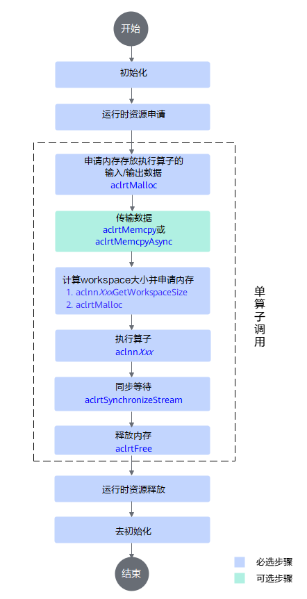
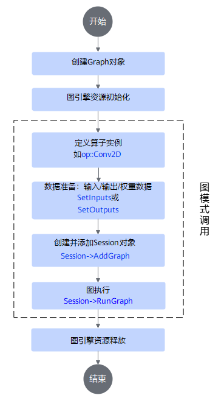

# 算子调用样例

## 概述

开发好的算子可通过多种方式调用，本项目已提供常见的调用方式：

- aclnn调用 **（推荐）**：以算子aclnnXxx接口方式（一套基于C语言的API，无需IR定义）调用算子。
- 图模式调用：以IR（Intermediate Representation）构图方式调用算子。

## aclnn调用

### 调用流程



详细的aclnn接口调用流程介绍请参考[《应用开发（C&C++）》](https://hiascend.com/document/redirect/CannCommunityInferWizard)中”单算子调用 > 单算子调用流程“章节。

### 调用示例代码

本代码罗列了调用流程中的关键步骤，仅为示例，**不支持直接拷贝运行**，其他aclnn接口的调用流程类似，请替换为实际aclnn API即可。

如需体验可执行样例，请访问每个算子的`examples/eager_mode`目录获取可执行算子调用代码，例如[test_aclnn_abs.cpp](../../math/abs/examples/eager_mode/test_aclnn_abs.cpp)，编译和运行操作可参见该目录下的README。

```Cpp
int main() {
    // 1. 调用acl进行device/stream初始化
    auto initStatus = aclnnInit();
    initStatus = aclrtSetDevice(deviceId);
    initStatus = aclrtCreateStream(stream);
    ......    
    std::vector<int64_t> qShape = {2048, 1, 128}; // 构造输入输出
    std::vector<int64_t> kShape = {2048, 1, 128};
    std::vector<int64_t> vShape = {2048, 1, 128};
    int64_t headNum = 1;
    char* layout = "SHB";
 
    // 2. 申请device侧内存
    auto ret = aclrtMalloc(deviceAddr, qSize, ACL_MEM_MALLOC_HUGE_FIRST);
    ......
    
    // 3. 将host侧数据拷贝到device侧内存上
    ret = aclrtMemcpy(*deviceAddr, qSize, hostData.data(), size, ACL_MEMCPY_HOST_TO_DEVICE);
    ......
    
    // 4. 调用aclnnXxxGetWorkspaceSize第一段接口
    auto callStatus = aclnnXxxGetWorkspaceSize(..., &workspaceSize, &opExecutor);
    ......
    
    // 5. 调用aclnnXxx第二段接口
    callStatus = aclnnXxx(workspaceAddr, workspaceSize, executor, stream);
    
    // 6. 同步等待任务执行结束
    ret = aclrtSynchronizeStream(stream);
    
    // 7. 释放device侧资源
    aclrtFree(selfDeviceAddr);
    aclrtFree(outDeviceAddr);
    aclrtDestroyStream(stream);
    aclrtResetDevice(deviceId);
    
    // 8. acl去初始化
    aclFinalize();
    
    return 0;
}
```

## 图模式调用

### 调用流程



详细的IR构图流程介绍请参考[《Ascend Graph开发指南》](https://hiascend.com/document/redirect/CannCommunityAscendGraph)中”构建Graph> 通过算子原型构建Graph“章节。
### 调用示例代码

本代码罗列了调用流程中的关键步骤，仅为示例，**不支持直接拷贝运行**，其他算子IR调用流程类似，请替换为实际算子IR即可。

如需体验可执行样例，请访问每个算子的`examples/graph_mode`目录获取可执行算子调用代码，例如[test_geir_abs.cpp](../../math/abs/examples/graph_mode/test_geir_abs.cpp)，编译和运行操作可参见该目录下的README。

```CPP
int main() {
    // 1. 创建图对象
    Graph graph(graphName);

    // 2. 图全局编译选项初始化
    Status ret = ge::GEInitialize(globalOptions);
    '''

    // 3. 创建xxx算子实例
    auto opName = op::xxx("opName");

    // 4. 定义图输入输出向量
    std::vector<Operator> inputs{};
    std::vector<Operator> outputs{};

    // 5. 准备输入数据
    auto shapeData0 = vector<dType>();
    auto data0 = op::Data("data0").set_attr_index(0); // 创建一个data0算子，index属性未0
    TensorDesc descData0(ge::Shape(shapeData0), FORMAT_ND, dType); // 算子输入/输出描述tensordesc
    data0.update_input_desc_x(descData0); // 设置算子输入描述
    data0.update_output_desc_y(descData0); // 设置算子输出描述
    opName.set_input_inputName(inputName); // 添加算子输入
    opName.set_attr_attrName(attrValue); // 设置属性值
    inputs.push_back(data0); // 输入添加到输入向量
    outputs.push_back(opName); // 输出添加到输出向量

    // 6. 设置图对象的输入算子核输出算子
    graph.SetInputs(inputs).SetOutputs(outputs);

    // 7. 创建session对象
    ge::Session* session = new Session(buildOptions);

    // 8. session添加图
    ret = session->AddGraph(graphId, graph, graphOptions);

    // 9. 运行图
    ret = session->RunGraph(graphId, input, output);

    // 10. 释放资源
    GEFinalize();

    return 0;
}
```