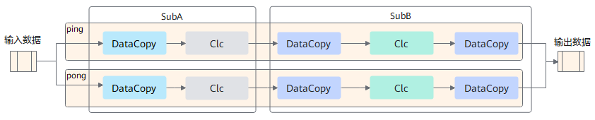
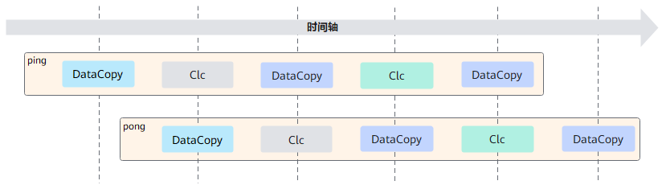
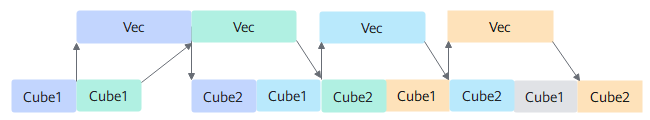
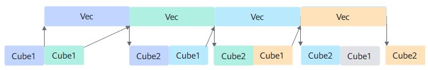

声明：本文使用[Creative Commons License version 4.0](https://creativecommons.org/licenses/by/4.0/legalcode)许可协议，转载、引用或修改等操作请遵循此许可协议。

# FA/FAG算子设计介绍

## 1 多模板设计

为了使不同的输入可以复用相同的tiling和流水，采用了模板的方式来实现融合算子，但是不同的输入全部使用同一套模板时又无法达到性能最优和功能泛化，因此需要根据输入shape的特征区分不同的模板来实现。
FA（FlashAttentionScore，简称FA）/FAG（FlashAttentionScoreGrad，简称FAG）融合算子的多模板设计思路主要为：

- **基本概念：**

  **CV基本块:** 表示Cube或者Vector单次计算的数据量大小，用来描述一次完整的Cube和Vector交互的数据量，通常也等价于**核间基本块**。在910B芯片上由于Cube和Vector之间通信有一定开销，所以CV基本块设置的比较大，一般合适的数据量大小是512*1024（单位Bytes）。又由于Cube和Vector的核内Buffer有限，所以核间基本块可能要通过**多次核内计算**完成。

  **核内基本块：**

  如果CV基本块过大，Cube和Vector核内会将CV基本块进一步的切分，切分成适合核内L0A、L0B、L0C、UB等大小的基本块，这个就叫**核内基本块**；对于Cube侧，核内基本块一般在32KB（单位Bytes)，这样可以让L0A、L0B的DoubleBuffer能力展开，同时算力和带宽也能尽可能用满；在Vector侧一般基本块大小是32KB（单位Bytes）。

  **xxx.i:** 表示经过切分后，CV基本块中的某根轴的大小, 一般基本块都是2维的，xxx.i 表示其中一个维度的大小。xxx可以是B、N2、G、S1、S2;
  例如，S1 = 512, S2 = 1024， S1.i = 64, S2.i = 128, 表示把[S1, S2]切分成大小是[64, 128]的基本块，S1轴的基本块大小是64，S2轴的基本块大小是128。

  **xxx.o**: 表示经过基本块切分后某根轴的分数，xxx可以是B、N2、G、S1、S2;

  例如，S1 = 512, S2 = 1024， S1.i = 64, S2.i = 128, 表示把[S1, S2]切分成大小是[64, 128]的基本块，S1.o = 512 / 64 = 8, S2.o = 1024 / 128 = 8 ，一共切分成8 * 8个基本块。

- **根据核内及核间切分进行模板拆分**

  由于硬件buffer大小是有限的，而计算的数据量又是巨大的，无法一次计算完，那么就需要进行tiling切分，shape不同会导致算子的切分轴不同，而算子的切分轴，会影响模板的功能及性能。简单的elewise类算子，往往会将所有的轴fuse成一根轴进行切分，逻辑简单，因此模板也比较单一。而融合算子融合了elewise、broadcast、reduce及matmul等多类场景，功能复杂，为达到较高的性能要求，往往需要根据切分轴进行模板拆分，模板拆分时为了达到性能最优，需要考虑如下几个点：

  a. 将核心的数量用满，防止部分核闲置 

  b. 每一个核心被分配的计算量相对均匀，避免出现某些核计算的数据量过大，其余核在围观的情况。

  c. AIC和AIV之间处理的数据量要符合其对应的算力，避免AIC或AIV出现长时间的空闲。 

  FA/FAG算子包含B、N2(key和value的N)、G(query_N/kv_N)、S1(query的S)、S2(key和value的S)共5个轴，切分顺序是先核内再核间，核内切分依据基本块大小选择切分轴，核间切分是把核内切分后剩余的轴合并后依据AI Core核数再进行切分。由于shape的大小不同，切分轴会发生变化，从Vector视角，FA/FAG算子划分为如下几类模板，模板按序号排优先级，序号越小，优先级越高，越先匹配。

  - FA算子根据切分轴不同，划分成以下几类模板，对于以下FA模板，目前都不会把S2轴切分到多核：

    > 1. 核间切分B、N2、G、S1轴，核内切分S1轴、S2轴模板，该模板是最通用模板，支持所有输入（TND除外）：
    >
    >    tiling代码文件：ops-transformer-dev/attention/flash_attention_score/op_host/flash_attention_score_tiling_general.cpp
    >
    >    tiling代码类：FlashAttentionScoreTilingS1s2Bn2gs1
    >
    >    kernel代码：ops-transformer-dev/attention/flash_attention_score/op_kernel/flash_attention_score_s1s2_bn2gs1.h
    >
    >    条件：S2 > 1024;
    >    依据: 由于Vector侧FlashSoftmax计算的shape是[S1, S2]，且FlashSoftmax操作需要S2切分的大小尽可能大，所以通常在FlashAttention中设定S2轴的基本块为1024。又由于FlashSoftmax当S2轴切分时会存在刷新流程，不断更新Softmax的结果，所以当S2大于1024时，计算流中会多一些Softmax的更新流程，这一点有别于其他模板。
    >    CV基本块选择:
    >    S1.i: 默认64，当按64切分时，如果B * N2 * G * S1.o超vector核数时，S1.i设置为128，这样做的目的是为了在S1比较小的时候，优先把核数用满，多核用满的性能较高
    >    S2.i: 1024
    >
    > 
    >
    > 2. 核间切分B、N2、G、S1轴，核内切分S1轴模板
    >
    >    tiling代码文件： ops-transformer-dev/attention/flash_attention_score/op_host/flash_attention_score_tiling_general.cpp
    >
    >    tiling代码类：FlashAttentionScoreTilingS1Bn2gs1
    >
    >    kernel代码：ops-transformer-dev/attention/flash_attention_score/op_kernel/flash_attention_score_s1_bn2gs1.h
    >
    >    条件：(128 < S2 <= 1024) ||  (N2 * G * (align(S1,16) + align(S2,16)) * align(D,16) * sizeof(INPUT_T)>= 512KB) || (N2 * G * (align(S1,16) + align(D,16)) * align(S2,16) * sizeof(INPUT_T))
    >
    >    依据: 当S2 < 1024时，由于S2不切分，所以不需要更新FlashSoftmax的结果，流程上更精简，不用上面第1点描述的那个泛化模板，由于S2 > 128时，切B模板不会带来性能提升，所以默认走这个模板。同时，在S2 <= 128时，如果不带Batch轴的matmul1或者matmul2的输入已经占满了整个L1，那么也不会走切B模板。切B模板的意思是，把batch轴做切分，核间基本块的大小是B.i * N2 * G * S1 * D (query的D) 或者B.i * N2 * G * S2 * D (key/value的D) 或者B.i * N2 * G * S1 * S2（softmax结果，即为P)；如果切B满足切分的要求，那么至少B.i 大于等于2，那么B.i内层的这些轴的乘积需要小于L1的大小。上面条件里面的判断就是基于此，Q * K和P * V中任何一个矩阵乘法的输入大于了L1的Size，那么走切B模板就没有收益。
    >
    >    CV基本块选择: 
    >
    >    S1.i: 会依据S2的大小，动态调整，尽可能的让S1 * S2的数据量大一些，目的是减少通信次数和通信开销。
    >
    >    S2不切分，S2的基本块大小 = S2
    >
    > 
    >
    > 3. 核间切分B轴，核内Cube侧不切分S1、S2把B.i, N2, G作为循环轴开循环处理batch matmul，Vector核内会把B.i * N2 * G * S1综合切分，找到最合适的核内基本块。
    >
    >    tiling代码文件：ops-transformer-dev/attention/flash_attention_score/op_host/flash_attention_score_tiling_general.cpp
    >
    >    tiling代码类：FlashAttentionScoreTilingB
    >
    >    kernel代码：ops-transformer-dev/attention/flash_attention_score/op_kernel/flash_attention_score_bn2gs1s2_b.h
    >
    >    条件：无法走到上述两个模板的其他shape
    >    依据：当S1、S2、D都比较小的时候，CV的基本块较小，我们将B.i, N2, G也纳入到CV基本块中，一次CV交互的数据量更大，提升执行性能。

  - FAG算子的模板划分如下，以下模板，序号越大，模板的优先级越高，序号1的模板是泛化模板(支持所有shape)：

    > 1. 核间切分B、N2、G、S1轴，核内切分S1轴、S2轴模板：
    >
    >    tiling代码文件：ops-transformer-dev/attention/flash_attention_score_grad/op_host/flash_attention_score_grad_tiling_s1s2_bn2gs1s2.cpp
    >
    >    tiling代码类：FlashAttentionScoreGradTilingS1s2Bn2gs1s2
    >
    >    kernel代码：ops-transformer-dev/attention/flash_attention_score_grad/op_kernel/flash_attention_score_grad_s1s2_bn2gs1s2.h
    >
    >    条件：支持所有shape，其他模板如果不支持，就会走到这个模板
    >    依据：这个模板按照最通用的做法，可以支持所有的Shape。但是由于核内一次只能处理S1 * S2的大小，当S1和S2都比较小的时候，会有频繁的CV交互开销，性能较差。当S1和S2都比较小的时候会路由到下面的这些模板。
    >
    >    
    >
    > 2. 核间切分B、N2轴，核内切分G、S1、S2，该模板是通过单纯的分核改变来优化S1、S2都比较小且(B * N2比较大或者G = 1)场景下的性能
    >
    >    tiling代码文件：ops-transformer-dev/attention/flash_attention_score_grad/op_host/flash_attention_score_grad_tiling_s1s2_bn2.cpp
    >
    >    tiling代码类：FlashAttentionScoreGradTilingS1s2Bn2
    >
    >    kernel代码：ops-transformer-dev/attention/flash_attention_score_grad/op_kernel/flash_attention_score_grad_s1s2_bn2.h
    >
    >    条件：(S1 < 1024) && (S2 < 1024)  && (B * N2 * 2 > CoreNum || G == 1)
    >
    >    依据：S1和S2都比较小，且B和N2比较大的时候，这时候把B和N2用于分核，核内不切分N2.i，循环N2.i次进行Cube和Vector计算。
    >
    >    
    >
    > 3. 核间切分B、N2.o轴，核内切分N2.i、G、S1、S2轴, 改模板是为了优化G * S1 * S2都比较小的场景时的性能，把N2轴切分到核内，并且在核内也切分N2.i轴，用于加速Vector计算。相比于模板2, 模板3会更复杂一些，模板3在核内计算中也切分了N2.i轴，让每次的计算量更大。
    >
    >    tiling代码文件：ops-transformer-dev/attention/flash_attention_score_grad/op_host/flash_attention_score_grad_tiling_ngs1s2_bn.cpp
    >
    >    tiling代码类：FlashAttentionScoreGradUngs1s2BbnTiling
    >
    >    kernel代码：FlashAttentionScoreGradUngs1s2Bbn
    >
    >    条件：G * S1 * S2 <= 32KB && G = 1 && S2 < 1536
    >
    >    依据：当G * S1 * S2小于32KB时，可以通过把N2轴切分一部分到核内，让CV基本块更大，同时在Vector核内，把N2.i的也进行切分，让单次Vector的计算量更大，提升Vector利用率。
    >
    >    
    >
    > 4. 核间切分B轴，核内计算B.i 、N2、 G、S1、S2轴，该模板是为了优化N2 * G * S1 * S2比较小时的性能
    >
    >    tiling代码文件：ops-transformer-dev/attention/flash_attention_score_grad/op_host/flash_attention_score_grad_tiling_bngs1s2_b.cpp
    >
    >    tiling代码类：FlashAttentionScoreGradUbngs1s2BbTiling
    >
    >    kernel代码：FlashAttentionScoreGradUngs1s2Bbn
    >
    >    条件：N2 * G * S1 * S2 <= 64 * 128
    >
    >    依据：如果希望单纯的把B.i放入CV基本块中，那么内层轴N2 * G * S1 * S2就需要足够小，一般是根据这个只小于64KB的话，Bmm1和Bmm2的数据量一般不会超过L1的一半，那么B轴切分时有意义的，否则单个Matmul就把L1用满，多个Matmul之间的数据搬入没有办法和计算并行。

  每一类模板都有其独特的UB及Block切分轴，能处理某一类具备特定shape特征输入的场景，针对该类shape特征进行模板设计。

- **根据特殊场景及特定优化进行模板特化**

  每一个融合算子有一个基础模板，并辅以多个特化模板：

  - 基础模板覆盖功能以及大部分此类shape特征输入的性能。
  - 特化模板是覆盖特定场景的极致性能，主要根据某些适用于特定场景的特殊手段进行的优化，不适合进行泛化。

  例如，根据特殊场景空tensor特化而出的empty_input模板，基于角色的cube核管理（RCM）优化方案设计的确定性计算模板等。

- **根据不同计算流水进行模板特化**

  为了充分发挥硬件优势，通常融合算子都需要进行流水设计，以提高融合算子性能，不同的流水设计对代码的架构影响非常大，为了提升代码的可维可测可读性，需要根据不同的计算流水进行模板特化，达到特定场景的极致性能。

## 2 tiling设计

Tiling操作的目的是为了找到一种更高效的NPU执行方式，原始的数据量一般是非常大的，没有办法通过一次指令调用就完成所有计算，因此需要将数据量分到多个核上并行计算，且每个核上也需要考虑如何循环计算性能最优，不同的输入可能有不同的最优执行方式，所以需要通过tiling策略决定怎么将数据分配到各个核上进行计算。

### 2.1 CV Tiling分离设计

 根据硬件架构特征，AI Core分成AIC和AIV两个独立的核，AIC和AIV核拥有自己独立的Scalar计算单元，能够独立加载自己的代码段，单独执行。AIC和AIV分离的架构可以使得AIC和AIV并行执行。AIC和AIV之间数据交互的通路是L2和HBM（High Bandwidth Memory，高带宽存储器），两者之间的交互次数对性能影响是比较大的，同时由于AIC和AIV算力差异，两者需要使用不同的基本块大小，本着尽量减少AIC和AIV通信次数和发挥最大算力的原则，CVtiling分离策略应运而生，可以有效地减少CV通信次数，同时根据不同单元的buffer特征，选择不同的基本块进行计算，从而提升算子性能。

 对于FA算子，Vector计算涉及多个输入、输出、中间计算结果、double-buffer设计等，需要将buffer分配成多份，最优分配方案中最大一份为32KB，由于Vector计算使用的数据类型是float32，因此Vector的tiling基本块为8 * 1024。为了充分发挥Cube的算力，在CV之间一轮计算的数据量进行了1:16的配比，又由于Cube侧的输入数据类型是float16，输出是float32，cube的基本块为128 * 128，所以通过nRation=8配比出128 * 1024的数据量。伪码如下：

```c++
// C-Tiling: (S1_c_i,D)x(D,S2_c_i) => (S1_c_i, S2_c_i):(128,1024)
// V-Tiling: (S1_v_i, S2_v_i) => (8,1024)

// C侧 matmul计算
Bmm((S1_c_i,D)x(D,S2_c_i)) => 128*1024  // 输出结果128*1024，放到workspace上
// V侧 vector计算
for S1_c_i/S1_v_i=128/8:
  copy_gm_to_ub(S1_v_i*S2_v_i)  // 从bmm的workspace上拷入bmm结果数据
  vector(S1_v_i,S2_v_i)         // 进行vector计算
  copy_ub_to_gm(S1_v_i*S2_v_i)  // vector计算结束，得到最终输出数据，拷贝到GM上

// 由于cube侧计算数据比vector侧大，因此，ub内需要再次进行Vector Tiling，从而产生了S1方向的配比：S1_c_i/S1_v_i
```

上述示例中，仅在S1方向开了配比，S2方向C/V计算的长度是一致的，当然，也可以在S1/S2方向均开启配比；这样做的好处是，Cube一次可以发射大块的数据，避免因为小块数据不断发射带来的通信开销，也能最大程度地使用Cube单元的buffer。

### 2.2 tilingkey设计

为了在运行态实例化一个确定的模板，需要通过tilingkey来唯一标识 。tilingkey生成实现如下：

```c++
constexpr uint64_t TILINGKEYOFFSET = uint64_t(10000000000000000000);  // 10^19
uint64_t GetTilingKey() const override {
    return GET_TILINGKEY(AxisEnum::S1, AxisEnum::S2, AxisEnum::NONE, implMode,
                         tilingKeyDType, tilingKeyLayout, tilingKeyBmm1Format,
                         SparseEnum::ANY, PerformanceOrientedEnum::BIG_DOUBLE_BUFFER,
                         hasDropOut, hasAttenMask, hasPse, enableL1Reuse);
}

template <typename... Args>
constexpr uint64_t GET_TILINGKEY(Args... templateIds) {
  return TILINGKEYOFFSET + RecursiveSum(templateIds...);
}

template <typename T, typename... Args>
constexpr uint64_t RecursiveSum(T templateId, Args... templateIds) {
  return static_cast<uint64_t>(templateId) + 10 * RecursiveSum(templateIds...);
}
```

**tilingKey生成规则**：按十进制位组装tilingkey，最多支持19个参数，当前实现包含以下关键参数，从低位到高位依次是：UB0、UB1、Block、ImplMode、DataType、Format、Sparse、BIG_DOUBLE_BUFFER、tilingKeyBmm1Format、hasDropOut、hasAttenMask、hasPse、enableL1Reuse，各参数说明如下：

- **UB0, UB1**：表示UB核内切分的轴，使用枚举AxisEnum表示，因为允许最多切分两根轴，所以存在UB0和UB1，如果没有UB核内切分，则填AXIS_NONE。UB0和UB1各占一个十进制位。

- **Block**：表示UB用来分核的轴，即核间切分轴，使用枚举AxisEnum表示，占一个十进制位。

- **ImplMode**：表示当前tiling key是否使能高精度的无效行计算，使用枚举ImplMode表示，占用一个十进制位。

- **DataType**：表示当前tiling key支持的输入输出的数据类型，使用枚举DtypeEnum来表示，占一个十进制位。

- **Format**：表示当前tiling key支持的数据格式, 使用枚举LayoutEnum表示，占一个十进制位。

- **Sparse**：表示当前tiling key是否支持Sparse，使用枚举SparseEnum表示，占一个十进制位。

- **BIG_DOUBLE_BUFFER**：表示当前tiling key是否支持双缓冲机制，使用枚举PerformanceOrientedEnum表示，占一个十进制位。

- **tilingKeyBmm1Format**：表示当前tiling key支持bmm1的输出格式，使用枚举CubeFormatEnum表示，占一个十进制位。

- **tilingKeyBmm2Source**：表示当前tiling key支持bmm2的数据来自GM还是L1，使用枚举CubeInputSourceEnum表示，占一个十进制位。

- **hasDropOut**：表示当前tiling key是否支持可选输入drop_mask，使用bool类型表示，占一个十进制位。

- **hasAttenMask**：表示当前tiling key是否支持可选输入atten_mask，使用bool类型表示，占一个十进制位。

- **hasPse**：表示当前tiling key是否支持可选输入real_shift，使用bool类型表示，占一个十进制位。

- **enableL1Reuse**：表示当前tiling key是否使能了L1复用，使用bool类型表示，占一个十进制位。

**其余特化场景，可以依次在后面定义自己的位域和值。**

## 3 流水设计

为了追求极致性能，必须充分利用硬件资源，通常需要进行不同pipeline的流水设计。流水设计的宗旨是尽量使某一条pipeline达成bound效果，使硬件的某一个单元一直在工作，达到性能上限。

### 3.1  V侧流水

V侧流水设计需要考虑Vector内部的搬运及计算过程，实施的优化手段主要是double buffer。
以下面的流水任务示意图为例，Vec的功能被拆分成2个流水任务：subA、subB，每个任务专注于完成单一功能；需要处理的数据被切分成2片，使用ping-pong表示两个数据处理任务，每个任务需要依次搬运DataCopy与计算Clc操作。任务间的箭头表达数据间的依赖关系，比如subA处理完DataCopy之后，subB才能对Clc进行处理。
从图上可以看出，不进行流水设计时，搬运与计算任务之间是串行执行的，会出现断流现象，即第一次DataCopy完成之后的搬运流水就一直处于空闲状态，直到第一次搬入的数据计算完成并搬出之后搬运流水才会继续工作，进行第二次DataCopy（Vector计算和搬出流水也存在同样问题）。通常这种情况下，性能是极差的。


将上图的流水任务做ping-pong流水间的double buffer处理后，流水任务运行起来的示意图如下，从运行图中可以看出，对于同一片数据，搬运DataCopy与计算Clc（Clc表示vector计算）之间的处理具有依赖关系，需要串行处理；不同的数据切片，同一时间点，可以有多个任务在并行处理，由此达到任务并行、提升性能的目的。



其中ping、pong两块计算数据所占用的内存资源均相互独立。
FA类融合算子V侧计算过程较多，情况也比较复杂，通常简单的double buffer是无法覆盖所有情况的，因此会出现不同的计算流水排布。不同的计算流水适用于不同类的shape特征，以达到在该类特征下最好的流水设计。

### 3.2 CV流水


融合算子通常包含了Vector计算和Cube计算，对于FA算子，V侧的计算是依赖C侧的计算结果的，如果只关注V侧流水，不关注C侧，则C侧与V侧很有可能是串行流水的效果，不能达到并行计算的目的，无法使得融合算子性能达到最优，从而有了CV流水设计。此外，CV流水在不同算子情况下，表现的现象也是不一致的，FA/FAG的Cube双发机制，又称为CV间preload流水，可实现两种场景下的流水优化：


- C侧总耗时 > V侧总耗时

  该场景流水特征下，Vector计算节点少，计算速度快，在<term>Atlas A2 训练系列产品</term> C:V=1:2的情况下，Cube的搬运时长足以掩盖Vector的计算时长，因此只要关注Cube的MTE2耗时即可，最终达成MTE2 bound。在Cube双发机制下，提前发射两块Cube计算，Cube1、Cube2计算可以衔接，使得Cube利用率最高，达成Cube bound。

  

- C侧总耗时 < V侧总耗时 

  该场景流水特征下，Vector计算节点多，Vector计算是瓶颈，C侧的搬运不足以掩盖V侧的流水，因此需要进行CV流水排布，尽量达到CV并行的效果，最通用的优化手段是C侧提前发射。

  

  C侧连续发射两块Cube计算，这样可以保证V侧计算完上一轮时，可以立马启动当前轮的计算，而不用等待Cube1的数据。这样可以使V侧一直在工作，达成Vector bound。

## 4 编程视角

### 4.1 AscendC高阶API

当前AscendC高阶API提供了两种编程模式，第一种是以Vector为主核，Cube为从核的视角，Vector0和Vector1会独立发起Matmul的任务，两者没有关联性。

第二种是以Cube为主核，Vector为从核，这时会由V0统一发起Matmul任务，这个任务的结果由V0和V1共同处理，一般是V0、V1各处理一半。当前如果某个模板的结尾是"_sab"，说明这个模板是一个以Cube为主核的模板。例如：

```c++
ops-transformer-dev/attention/flash_attention_score/op_kernel/flash_attention_score_s1s2_bn2gs1_sab.h
    
ops-transformer-dev/attention/flash_attention_score_grad/op_kernel/flash_attention_score_grad_s1s2_bn2gs1s2_sab.h 
```

以Cube为主核对于FlashAttention来说由于V0、V1的Matmul任务可以复用左矩阵，且输出的部分结果可以在L0C累加，减少了对于带宽的依赖诉求，大部分场景性能会更优。


### 4.2 AscendC低阶API

当前还存在一些没有使用AscendC高阶API的模板，例如：

```c++
ops-transformer-dev/attention/flash_attention_score_grad/op_kernel/flash_attention_score_grad_s1s2_bn2gs1s2_basic.h
```

这个模板更加彻底的使用了以Cube为主核，Vector为从核，这时Matmul的任务都已经完全从Cube侧发起，通过同步通知Vector侧。