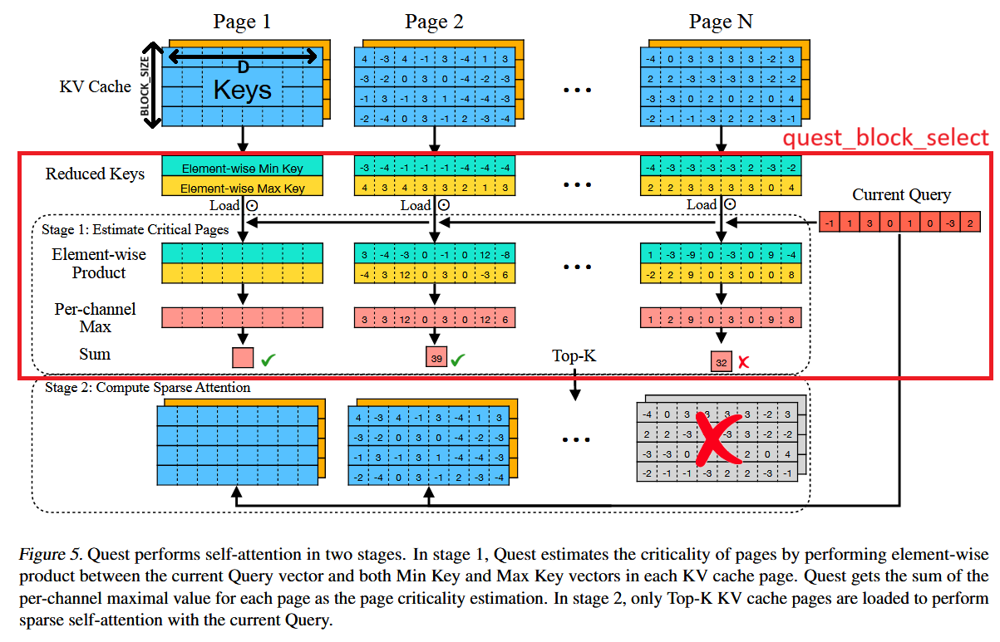

# Decoding Operators Python Library

Operator `quest_block_select_paged` is implemented in this directory. The operator allows to predict the top k important KV-blocks based on their metadata (maxblocks and minblocks, arranged in blocks of BLOCK_SIZExBLOCK_SZIE) and the incoming query. The implementation is a vector-only kernel that follows the [Quest ICML2024 paper](https://arxiv.org/abs/2406.10774). We extend the original implementation with GQA support: query heads are grouped and averaged such that the prediction of the importnat k blocks are returned per KV-head and not per attention head. 


 

This operator works with arbitrary number of metadata blocks, which is essential for handling variable-length sequences efficiently in attention mechanisms. The metadaa is managed in VLLM-compatible metadata blocks, which can be stored in the same blocks as the KV-cache.

```text
Input:
    query - fp16/bf16 tensor of shape (B, H, D)
    maxblocks - fp16/bf16 tensor of shape (num_meta_blocks, BLOCK_SIZE, N, D) - metadata with maximum vectors for each key-cache block
    minblocks - fp16/bf16 tensor of shape (num_meta_blocks, BLOCK_SIZE, N, D) - metadata with minimum vectors for each key-cache block
    metadata_block_tables - int32 tensor of shape (B, MMBPR) - block tables mapping sequences to metadata blocks
    seq_lens - int32 tensor of shape (B) - sequence length of each request in the batch
    k - integer specifying how many block-indices to return for each KV-head

Algorithm steps:
1. For every batch, reduce-mean the query tensor across H dimension 
    such that every group of H/N vectors of shape D are reduced to one vector
    of shape D denoted as "grouped_query[b,n]".
2. For each batch b and KV-head n:
    2.1. Use metadata_block_tables[b] to locate the relevant metadata blocks for the sequence
    2.2. For each metadata block in the sequence:
        2.2.1. product_max, product_min = Elementwise-multiply grouped_query[b,n] with each maxblock and minblock vector
        2.2.2. channel_max_product = Elementwise-max between the two products (product_min, product_max)
        2.2.3. block_scores = Reduce-sum the last dimension of approx_attention (D to 1)
    2.3. selected_values, selected_indices = Find the top-k indices across all relevant blocks
3. Return selected_indices
```
The operator prototype is as follows.  
```c++
/** @brief Interface the `quest_block_select_paged` kernel.
 *
 * @param [in] query Tensor(fp16) containing the query vector [B,H,D]
 * @param [in] maxblocks Tensor(fp16) containing quest metadata with the maximum vectors of every key-cache block (num_meta_blocks, BLOCK_SIZE, N, D)
 * @param [in] minblocks Tensor(fp16) containing quest metadata with the minimum vectors of every key-cache block (num_meta_blocks, BLOCK_SIZE, N, D)
 * @param [in] metadata_block_tables Tensor(int32) containing the metadata block tables [B,MMBPR]
 * @param [in] seq_lens Tensor(int32) containing sequence length of each request in the batch [B]
 * @param [in] k natural number of highest indices to return for every KV head
 * 
 * @returns selected_indices - Tensor(int32) where the kernel will output the selected indices vector. [B,N,k] 
 */
at::Tensor quest_block_select_paged(at::Tensor query,
                                    at::Tensor maxblocks,
                                    at::Tensor minblocks,
                                    at::Tensor metadata_block_tables,
                                    at::Tensor seq_lens,
                                    int k
);
```

Operator sizing parameters are:
 - `B` - batch size
 - `N` - number of KV heads
 - `H` - number of attention (aka query) heads, must be a multiple of N
 - `num_meta_blocks` - total number of metadata blocks in the pool
 - `BLOCK_SIZE` - number of tokens that fits in one maxblock and one minblock (default: 128)
 - `D` - head dimension (default: 128)
 - `MMBPR` - maximum metadata blocks per request
 - `k` - number of important block indices to return for each KV head (top-k, default:8)

Implementation Notes
 - Performance limitations require *D* = 128 and *BLOCK_SIZE* = 128
 - Requires Grouped Query Attention (GQA) configuration where H % N == 0
 - When for a given request r: `k > seq_lens[r] // BLOCK_SIZE` (i.e. there is not yet k blocks in the kv-cache at all) the kernel will run nevertheless, providing top-k indices, although some of them garbage (computed on the filler part of the metadata block) - it is therefore the user's responsibility to use this kernel with a k that is larger than the number of the KV blocks.
 

### Build the operators and their torch extension

```bash
./build.sh
```

### Usage
Once the operator was built, it can be used in your python code as follows:
```python
import torch
import torch_npu
from select_attn_decoding_ops import quest_block_select_paged

# Create dummy inputs
B, H, N, BLOCK_SIZE, D = 20, 32, 8, 128, 128
MMBPR = 2
k = 8
dtype = torch.float16
device = "npu:0"
num_meta_blocks = B * MMBPR
max_seq_len = MMBPR * BLOCK_SIZE * BLOCK_SIZE
query = torch.empty(B, H, D, dtype=dtype).uniform_(-1, 1).to(device).contiguous()
maxblocks = torch.empty(num_meta_blocks, BLOCK_SIZE, N, D, dtype=dtype).uniform_(-1, 1).to(device).contiguous()
minblocks = torch.empty(num_meta_blocks, BLOCK_SIZE, N, D, dtype=dtype).uniform_(-1, 1).to(device).contiguous()
metadata_block_tables = torch.randint(0, num_meta_blocks, (B, MMBPR), dtype=torch.int32).to(device).contiguous()
seq_lens = torch.randint(1, max_seq_len, (B,), dtype=torch.int32).to(device).contiguous()

# Run the quest paged operator
ids = quest_block_select_paged(query, maxblocks, minblocks, metadata_block_tables, seq_lens, k)
# Output shape: [B, N, k]
```

### TODOs

1. improve bf16 performance by tiling across block size dimension - to not allocate huge 64KB buffers for maxblock and minblock, and to enable full double buffering when loading the minblocks and the maxblocks

## Good practices
1. If you only modify the operator file `quest_block_select_paged.cpp`, you need to only re-run compile.sh to start observing the effect.
2. If you modify the `torch_interface.cpp`, you need to rebuild the select_attn_decoding_ops python package using build.sh.
