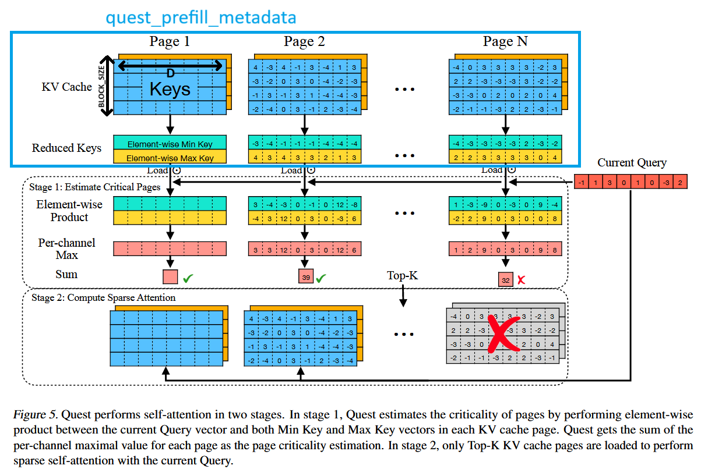

# Prefill Operators Python Library

## 1 - Quest Prefill Metadata (initialization of metadata) operator

Operator `quest_prefill_metadata` computes initial metadata from the K cache. Based on the paper [Quest ICML2024 paper](https://arxiv.org/abs/2406.10774). 

 


__Brief functionality description:__ in every K-cache block - a D-dimentional vector metadata-MAX-vector is computed (maximum along token dimension -> D to 1 reduction), and for BLOCK_SIZE of such blocks (16384 tokens) we obtain BLOCK_SIZE such metadata-MAX-vectors which are packed into a single metadata-MAX-block. This metadata-block is be written into a specially determined region _maxblocks_ in GM. Same procedure, but with minimum instead of maximum reduction, is performed to determine a metadata-MIN-block, which is stored in the _minblocks_ in the same specially predetermined block index. These special predetermined indices are an argument passed to the kernel "metadata_block_tables" - a 2D table with MMBPR indices per request.


__Operator prototype:__
```c++
/**
 * @brief Interface the `quest prefill metadata` kernel.  This is the interface 
 *        function which is invoked from the python level. It handles
 *        1. resolving tensor shapes
 *        2. Passing the pointers of the input tensors to the kernel
 *        3. Invocation of the kernel
 *        4. Returning the pointer of the output 
 *
 * @param [in] k_cache (num_kv_blocks, BLOCK_SIZE, N, D)
 * @param [in] block_tables (B, MKBPR) - for every request b: block_tables[b] is 
                             a list of kv block indices 
 * @param [in] seq_lens (B,) - sequence length (in token number) per request
 * @param [in] metadata_block_tables (B, MMBPR) - for every request b: block_tables[b] is 
                             a list of metadata block indices 
 * @param [out] maxblocks (num_meta_blocks, BLOCK_SIZE, N, D) - maxblock metadata, arranged in blocks of equivalent size to kv_cache blocks
 * @param [out] minblocks (num_meta_blocks, BLOCK_SIZE, N, D) - maxblock metadata, arranged in blocks of equivalent size to kv_cache blocks
 *
 * note: num_kv_blocks can be equal to num_kv_blocks and one may even pass maxblocks = k_cache, minblocks = v_cache to reuse the same page tables of vllm
 */
void quest_prefill_metadata(at::Tensor k_cache,
                            at::Tensor block_tables,
                            at::Tensor seq_lens,
                            at::Tensor metadata_block_tables,
                            at::Tensor maxblocks,
                            at::Tensor minblocks
)
```

Operator sizing parameters are:
 - `B` - batch size
 - `N` - number of KV heads
 - `BLOCK_SIZE` - number of tokens that fits in one maxblock and one minblock (default: 128)
 - `D` - head dimension (default: 128)
 * `MKBPR` - maximum number of blocks in every entry of the block_tables (num columns)
 * `MMBPR` - maximum number of blocks in every entry of the metadata_block_tables (num columns)
 
__Kernel Limitations__: BLOCK_SIZE=D=128

### Build the operators and their torch extension

```bash
./build.sh
```

### Usage
Once the operator was built, it can be used in your python code as follows:
```python
import torch
import torch_npu
from select_attn_prefill_ops import quest_prefill_metadata

# === create dummy inputs ===
device = torch.device('npu:0')
dtype_ind, dtype_val = torch.int32, torch.float16
B, N, BLOCK_SIZE, D = 4, 8, 128, 128
MKBPR = 200 # number of kb blocks in every request
MMBPR = (MKBPR + BLOCK_SIZE - 1) // BLOCK_SIZE
num_kv_blocks = B * MKBPR
num_meta_blocks = B * MMBPR 
max_seq_len_per_req = BLOCK_SIZE * MKBPR
seq_lens = torch.tensor([max_seq_len_per_req]*B, dtype=dtype_ind, device=device)
# k_cache:
k_cache = torch.randn(num_kv_blocks, BLOCK_SIZE, N, D, dtype=dtype_val, device=device)
# block tables and metadata block table - containing block ids:
perm_kv_blk_ids = torch.randperm(num_kv_blocks, device=device)[:num_kv_blocks]      
block_tables = perm_kv_blk_ids.reshape((B, MKBPR)).to(dtype=dtype_ind, device=device)                       
perm_meta_blk_ids = torch.randperm(num_meta_blocks, device=device)[:num_meta_blocks]      
metadata_block_tables = perm_meta_blk_ids.reshape((B, MMBPR)).to(dtype=dtype_ind, device=device)      
# placeholder for kernel outputs:
maxblocks = torch.zeros(num_meta_blocks, BLOCK_SIZE, N, D, dtype=dtype_val, device=device)
minblocks = torch.zeros(num_meta_blocks, BLOCK_SIZE, N, D, dtype=dtype_val, device=device)

# === run the quest prefill metadata operator, the outputs will be filled into (maxblocks, minblocks) ===
quest_prefill_metadata(k_cache, seq_lens, block_tables, metadata_block_tables, maxblocks, minblocks)  

```

### TODOs
1. Dobule check why bf16 passes even though the whole min/max processing happens in fp16.

### Good practices
1. If you only modify the operator file `quest_prefill_metadata.cpp`, you need to only re-run compile.sh to start observing the effect.
2. If you modify the `torch_interface.cpp`, you need to rebuild the select_attn_prefill_ops python package using build.sh.
